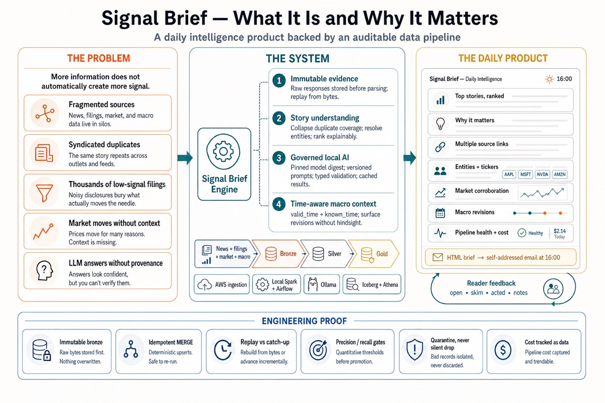
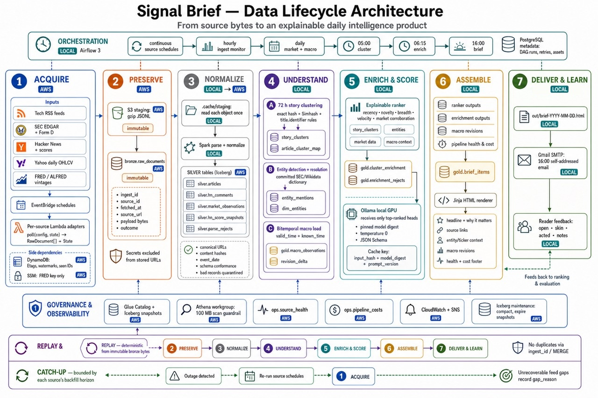

# Signal

*A daily tech / finance / economy brief, and the pipeline that earns it.*

Ingests public news, filings, and macro data on a 15-minute cadence; stores raw responses
immutably; collapses syndicated coverage into ranked story clusters; and publishes a brief
at 16:00 Africa/Casablanca with lineage, replay, cost controls, and locally run LLM
enrichment built in.



**Stack:** Python 3.12 · AWS Lambda + S3 · Apache Iceberg · Spark 4 · Terraform · Airflow · Athena ·
Ollama (local LLM) · Power BI

**Nine sources → bronze → silver → story clusters → ranked brief.** Ingestion is serverless because it
must run whether or not a laptop is on; processing is local Spark because EMR and MWAA buy nothing here
that `s3a` and Docker Compose do not.

| | |
|---|---|
| **The hard parts** | Story-level dedup (one acquisition arrives as 40 articles) · entity resolution to tickers · a local LLM as a *governed* pipeline stage (cached, validated, quarantined, versioned) · a bitemporal macro store, because CPI gets revised for months |
| **Measured** | Dedup 1.000 / 0.500 held out (n=252) · entity resolution 0.833 / 0.556 held out (n=300) · one brief costs **$0.00014** in Athena · replay after a 24.2 h outage re-read 23,306 rows and committed **0** |
| **Honest about** | The enrichment eval has a harness and no labels yet, so it reports *unscored* rather than guessing. Held-out numbers are quoted instead of the flattering full-set ones. Bad metrics stayed published while they were bad. |

Full numbers, including the ones that are still blank, are in [Measured, not claimed](#measured-not-claimed).
New to data engineering? [`docs/how-signal-works.md`](docs/how-signal-works.md) assumes nothing.

<details>
<summary><b>Detailed build status — phases 0 through 4B</b></summary>


**Status (2026-08-28): Phases 0-4A merged; Phase 4B deployed and running, acceptance pending
on evidence that takes calendar time.** Nine pollers — Hacker News (items and top-story
scores), SEC EDGAR + Form D, three RSS/Atom feeds, daily market bars, and ALFRED macro
vintages — run as scheduled Lambdas and land raw payloads in S3; local Spark jobs
commit them to `bronze.raw_documents` on Iceberg, normalize that into
`silver.articles` and `silver.hn_comments`, collapse it into story clusters, and resolve
company mentions against a pinned SEC + Wikidata dictionary. **Both labeled eval sets
are committed and
scored** — 252 article pairs and 300 entity mentions — and a real brief has been read every
morning since 3.0, which is what Phase 3's acceptance actually asks for. The infrastructure
is Terraform, and applied.

**Phase 4A** adds the ranker over those clusters — five of SPEC §7.4's six components, with
novelty deferred to 4B on the record rather than by omission — plus email at 16:00, a nightly
Iceberg maintenance job, a feedback CLI, and the five items SPEC §12 carried forward. Its
acceptance is behavioural and takes calendar time: three mornings read with marks recorded.
See [`docs/runbooks/phase-4a.md`](docs/runbooks/phase-4a.md).

**Phase 4B** adds the two things the README leads with: the governed local-LLM stage — one
call per ranked cluster head, content-hash cached, Pydantic-validated, quarantined when it
fails, scored per model digest and prompt version — and the ALFRED bitemporal macro store,
which keeps every vintage so "what was knowable on 2026-03-14" is a query rather than an
archaeology project. **Both are deployed and have run against real data.** The macro poller
was applied and verified on 2026-08-23 the way a deploy should be — the live Lambda's
CodeSha256 matched the build, and an invocation returned 6 of 6 series — which is what took
`macro` out of `NOT_YET_DEPLOYED` and made it source #9. The enrichment stage has run over
real windows against a live Ollama with its ADR-0003 digest verified; the first clean batch
was 40 heads in 80.2 s with zero schema failures, and the run before it enriched 2,979
clusters by mistake, which is recorded in the runbook rather than tidied away.

What is left is evidence, not construction: the enrichment eval has a harness and **no
labeled examples yet**, so `evals/score.py` reports it unscored rather than guessing, and the
30-day reproducibility backfill cannot close before **2026-09-17**, because ingestion started
on 2026-08-18. See [`docs/runbooks/phase-4b.md`](docs/runbooks/phase-4b.md).

**[ADR-0009](docs/decisions/ADR-0009-embeddings-for-same-story-and-entities.md) closed the
phase with two verdicts, measured rather than argued.** Sentence embeddings beat the lexical
same-story rule — held-out recall 0.500 → 0.909, at a precision cost that does not chain at
corpus scale — so the stage is adopted, and scheduled for 4B via Ollama rather than shipped
now behind 1.1 GB of torch. They do **not** beat the lexical resolver, and the reason turned
out not to be the model: the entity dictionary has no descriptions to embed, and its alias
index caps *any* context-scoring rule at 0.630 recall against 0.611 shipped. A gap recorded
for two phases as "needs embeddings" was a data gap the whole time.
[`docs/runbooks/phase-3.md`](docs/runbooks/phase-3.md) is where the phase stands, including
what broke on first real use, and there is a lot of that.

**Replay and catch-up are not the same promise.** Replay reprocesses an interval from bytes
already in `bronze/` — deterministic, and always available. Catch-up re-fetches what was
missed during downtime, and is bounded by each source's backfill horizon: Hacker News can be
recovered completely, EDGAR for about a day, and an RSS feed only as far back as its current
window. What catch-up cannot recover is recorded as a `gap_reason` per source per interval
in `ops.source_health` and printed in the brief's footer, rather than left to look like a
quiet day (SPEC §6.3). Both halves have now been tested against the deployed pipeline with a
deliberate 24.2-hour ingestion outage — the numbers are below and the walkthrough is in
[`docs/runbooks/phase-1.md`](docs/runbooks/phase-1.md) 1.D.

**The shape of it**, in one line: ingestion is serverless and in AWS because it must run
whether or not a laptop is on; processing is local because EMR, MSK and MWAA buy nothing here
that `s3a` and Docker Compose do not. [`docs/architecture.md`](docs/architecture.md) draws
both halves, the table lineage, and what is deliberately still missing.

**New to data engineering?** [`docs/how-signal-works.md`](docs/how-signal-works.md) explains
what each phase is for, in plain English, with no prior knowledge assumed.



</details>

## Quickstart

```bash
make setup      # uv sync + pre-commit hooks
make skeleton   # fake source -> bronze -> silver -> clusters -> HTML brief
make test
make eval       # score labeled sets, enforce accuracy floors
```

`make skeleton` writes `out/brief-<date>.html`. It touches no network and no AWS account.

Requires Python 3.12, JDK 17 (Spark 4), Docker, and — for Phases 1+ — Terraform ≥ 1.11 and
an AWS account with the guardrails in SPEC §10.2 already in place. On Windows, run
everything inside WSL2 (ADR-0002).

## What this is not

"News aggregator with sentiment analysis" is the most-built project in this space. The
aggregation here is a couple of hundred lines. The project is the four layers around it:

1. **Story-level deduplication** — the same acquisition arrives as 40 articles.
2. **Entity resolution** — mentions to canonical companies to tickers, with measured accuracy.
3. **A local LLM as a governed pipeline stage** — cached, validated, evaluated, versioned.
4. **A bitemporal macro store** — because CPI and payrolls get revised for months.

## Measured, not claimed

SPEC §15: never publish a metric the pipeline cannot recompute. Current numbers:

| Metric | Value | Source |
|---|---|---|
| Dedup precision / recall, **real pairs** | **1.000 / 0.500** held out · 0.962 / 0.568 full set (n=252) | `evals/fit_thresholds.py`, labeled 2026-08-20 |
| Dedup precision / recall, Phase 0 fixture | 1.000 / 1.000 (n=55) | `make eval` — a harness canary, not evidence |
| **Entity resolution precision / recall** | **1.000 / 0.593** held out · 0.944 / 0.630 full set (n=300) | `evals/fit_thresholds.py --set entities`, labeled 2026-08-20, corrected 2026-08-29 (ADR-0018) |
| Dedup ratio | 11 → 7 clusters (fake) · 4,296 → 4,253 (real, 1.01x) | `make skeleton` / `signal brief` |
| Entity resolution, one production window | 20,760 mentions detected over 4,303 articles → 2,509 linked (12.1%), 1,018 distinct companies | `spark/jobs/resolve.py`, real AWS |
| Cost of one brief | **10 Athena queries, 1.93 MB scanned, $0.0005** | brief footer, real AWS |
| Ingestion, one production window | 521 bronze rows → 207 articles (19 quarantined, all `hackernews`/dead-item) | `docs/runbooks/phase-2.md` 2.E, real AWS |
| Athena, `SELECT *` vs. projected vs. partition-pruned, same question | 184,259 / 73,373 / 64,713 bytes scanned | `docs/athena.md`, real AWS |
| S3 egress, one commit | 3,468,248 bytes | `ops.pipeline_costs`, real AWS |
| Replay after a 24.2 h outage | 23,306 rows re-read, **0 committed**, table unchanged | `docs/runbooks/phase-1.md` 1.D, real AWS |
| Replay during active catch-up | 4 consecutive hourly MERGEs, each re-reading the full table and inserting only the new rows | `docs/runbooks/phase-1.md` 1.D, real AWS |
| Catch-up after the same outage | RSS lost 0.0 / 3.6 / 5.3 h of 24.2 h; HN lost nothing | `docs/runbooks/phase-1.md` 1.D, real AWS |
| Embeddings vs. the lexical same-story rule | **refused on the corpus measurement**: no threshold ≥0.90 changes a decision; 0.85 buys recall 0.568→0.705 and emits **4,841 false edges across 1,680 heads** (a spanning tree needs 1,679) | `evals/experiments/embed_dedup_ollama.py`, ADR-0017 |
| Entity descriptions (`?itemDescription`) | **refused**: of 20 unreachable mentions, 17 are absent from the dictionary and 3 unindexed — a description arbitrates none. Of 6 precision errors, **1** | `evals/experiments/candidate_ceiling.py`, ADR-0018 |
| LLM stage, first clean batch | 40 heads in **80.2 s**, 0 schema failures; second run 100% cache, 0 model calls | `docs/runbooks/phase-4b.md`, live Ollama |
| **LLM enrichment precision / recall** | **0.747 / 0.782** (n=95) · topic 0.789 · summary entailed 0.853 | `make eval`, labeled 2026-08-29 — see the caveat below |
| Cost per day (full pipeline) | — | Phase 4A — pieces above are real, a full day's total isn't assembled yet |
| Consecutive daily briefs | **day 3** · 6 briefs since 2026-08-23, longest 3, **missed 2026-08-26** | `signal streak`, computed from `gold.brief_items` |
| Novelty, one production window | **37.3%** of 1,680 heads are a near-exact repeat (cosine ≥0.99) of the prior 30 days | `evals/experiments/novelty_floor.py`, real AWS |
| Publisher breadth | **99.64%** of clusters hold exactly one publisher (1,674 of 1,680) | `signal athena-query`, real AWS |

The fixture's 1.000/1.000 proved the harness runs, not that the clustering is good — and
Phase 3's 252 real labeled pairs showed how much daylight sat between those two claims. On a
base-rate sample the Phase 0 rule made 34 merges and **every one was wrong**, while missing
23 of 43 genuine same-story pairs; one cluster in the first real brief swallowed 64% of the
corpus. 3.B fixed both, and the numbers above are what replaced them. The bad ones stayed
published while they were bad — a metric you report only once it flatters you is not a
metric — and the whole arc is in [`docs/runbooks/phase-3.md`](docs/runbooks/phase-3.md).

**Entity resolution reached 0.833 / 0.556 the same way, and the interesting result was that
more data made it worse.** Adding every business Wikidata knows dropped held-out precision
below the SEC-only baseline — an alias index is only as precise as its rarest junk entry, and
the subclass closure of "business" contains every football club ever recorded. A stricter
notability floor made the dictionary a third of the size *and* better on both axes. Two
fitting procedures were also tried and thrown away because the held-out half caught them
overfitting; the one that survived is in `evals/fit_thresholds.py` with the rejected ones
documented beside it.

**Reading the brief is what finds the defects.** 3.D pointed it at the real cluster and entity
tables and, with every test and both eval gates green, the page was wrong four ways: a
deployed table two columns behind its DDL, a staleness warning that fired every day, a
45-article cluster merging a Disney lawsuit with a corgi tracker, and a `breadth` floor that
put nine SEC form numbers on the front page. None of them had a failing test. That is the
argument for SPEC §12's brief ladder, and it is why the count of briefs read is in the table
above.

Three caveats carried on purpose. **Quote the held-out row, not the full set**: half of each
full set was fitted on, so 0.962 and 0.868 are optimistic by construction, while 1.000 / 0.500
and 0.833 / 0.556 were measured on examples the fitting never saw. **Parts of the resolver are
inert at the fitted floor** — prefix matching and context corroboration both locate an entity
and then decline to link it — and that is documented and pinned in tests rather than left to
imply the system does more than it does. And **these labels were made by an LLM assistant and
then reviewed by the reader**, who overrode three (`labeler` is stamped on every record,
`reviewed_from` on every overridden one) — so the figures measure agreement with a model on
the bulk of each set, spot-checked where the rule and the labeler disagreed.

**The ranker was five-sixths of its spec for two phases, and the sixth component exposed
what the other five were doing.** SPEC §7.4 names six; `novelty` was deferred through 4A and 4B
because every embedding sat behind Ollama. Landing it in Phase 5 meant first asking why five of
the six read `0.00` on the real page — and the answers were not ranking bugs:

- **`recency` read exactly `0.000` for five consecutive days** and `0.901` on the sixth: the day
  ADR-0014 replaced five crons with an asset-ordered chain. `cluster` had been reading yesterday's
  bronze, so every story the ranker saw at 16:00 was already a day old. `relevance` looked
  saturated at 0.94–0.98 because it was the only live term, not because it was crowding out the
  others; it fell to 0.64 the moment `recency` started competing.
- **`breadth` cannot fire in this corpus.** 99.64% of clusters hold exactly one publisher — and
  not because clustering is broken: all six multi-publisher clusters in a window are correct
  ars/verge/techcrunch/HN merges. 64% of the corpus is single-publisher SEC filings and 30% is
  Hacker News pointing at 477 distinct domains. A quarter of the score was resting on a signal
  this source mix emits for 0.36% of clusters. It is now 0.05, and goes back up when wire
  sources land — with the measurement that raises it.
- **One feedback mark existed across 60 items**, and the cause was the product, not the reader:
  marking needs a `cluster_id` and the page printed none, so the loop required copying a
  64-character hash out of a table nobody could see. The card now prints eight characters and
  `signal feedback` resolves a prefix.

**The enrichment figure is a model grading a model, and the labels are unreviewed.** 0.747/0.782
comes from 95 distinct examples whose `labeler` is stamped `claude-opus-5 (assistant),
unreviewed` — unlike the dedup and entity sets, which the reader reviewed and overrode three of.
The stratified draw earned its keep on first use: SEC filings score **1.000** on topic and get
`filing_type` wrong 12 times in 20, so a uniform draw (57% filings) would have published a topic
accuracy near 0.9 earned on the trivially classifiable half. `company` false-positives 17 times
and every one is the publisher domain read as the subject. `round_type` fires zero times in 95 —
the abstention `enrich/schema.py`'s nullability was written for, measured rather than assumed.

**The embedding decision reversed itself once the vehicle existed, and that is the reversal
worth reading.** ADR-0009 adopted embeddings for same-story dedup on a `sentence-transformers`
measurement, then rejected `sentence-transformers` as the vehicle on packaging grounds.
ADR-0016 built the vehicle it chose — `nomic-embed-text` through Ollama, pinned by digest — and
asking the question again through the encoder that would actually ship refused it (ADR-0017).
The first measurement was not careless; it was taken on the labeled set alone, which is the axis
3.B had already shown to be insufficient. The same encoder is in production for `novelty`, where
the property that ruins dedup — templated filing titles scoring as near-identical — is exactly
what is wanted.

The two older embedding rows are measured, reproducible, and **not runnable by `make eval`** —
deliberately. Deciding whether a 1.1 GB dependency earns its place by first adding it to
`pyproject.toml` would answer the question by assumption, so `evals/experiments/` runs
against a throwaway virtualenv and each script carries the command that builds one. Both
imported their split, objective and constraint selection from `evals/fit_thresholds.py`
rather than choosing friendlier ones.

**The last thing Phase 3 measured was its own fitting procedure, and that is the finding
worth reading.** `evals/fit_thresholds.py` chooses the same-story constants; asked to
re-derive them, it returned a configuration disagreeing with the shipped code in three places
and recommending exactly the value 3.D had removed for merging a Disney lawsuit with a corgi
tracker. Nothing had failed, because a fitter's output is prose until someone reads it. The
cause: of the four constants in the grid, **252 labeled pairs determine one**. 336 of 385
feasible grid points tie at the top score, so a tuple-order tiebreak was silently choosing
the rest — and choosing badly. The fit now breaks ties by keeping what ships, reports which
constants the labels leave free, and is pinned by tests; the two that a corpus rather than a
labeled set must decide were moved out of the grid entirely, with
`evals/experiments/corpus_merge_rate.py` as the thing that decides them.

Every Athena dollar figure behind the bytes-scanned numbers above floors at Athena's real 10 MB
per-query minimum (`ops/athena.py`) and currently rounds to the same $0.0000477 per query —
the lake is still small enough that bytes scanned, not cost, is the metric that actually
moves; see `docs/athena.md` for why that's stated rather than hidden.

## Layout

| Path | Contents |
|---|---|
| [`SPEC.md`](SPEC.md) | The specification. Start here |
| [`src/signal_core/contracts.py`](src/signal_core/contracts.py) | The poll contract every source implements |
| `src/signal_core/` | Sources, transform, dedup, entities, Spark jobs, ranking, rendering, ops |
| `warehouse/entities/` | The pinned SEC + Wikidata dictionary the resolver is measured against |
| `handlers/` | Lambda entry point — one artifact, N functions |
| `infra/terraform/` | `bootstrap/` (state backend), `main/` (everything else) |
| `evals/` | Labeled sets, scorers, and the accuracy floors CI enforces |
| `evals/experiments/` | Measurements that decide a question without shipping a dependency — ADR-0009's embedding trials, and the corpus-level false-merge rate a pairwise eval cannot see |
| [`docs/architecture.md`](docs/architecture.md) | What runs where, and why the AWS/local line falls where it does — diagrams, table lineage, and what is not built yet |
| [`docs/operations.md`](docs/operations.md) | How Signal runs day to day: the 16:00 critical path, replay vs. catch-up, and failure-to-response mapping |
| [`docs/athena.md`](docs/athena.md) | Querying the lake: setup, real questions, the `SELECT *` vs. projected vs. partition-pruned measurement |
| [`docs/how-signal-works.md`](docs/how-signal-works.md) | What each phase is for, in plain English — no prior knowledge assumed |
| [`docs/decisions/`](docs/decisions/) | ADRs, including the ones that reversed earlier choices |
| `docs/archive/` | Superseded specs, kept for the decision trail |

## Adding a source

The design's central claim is that this takes 30 minutes:

1. Write `src/signal_core/sources/<name>.py` implementing
   `poll(config, state) -> (list[RawDocument], State)`.
2. Register it in `src/signal_core/sources/__init__.py` and `config.SOURCES` — declaring
   its **backfill horizon**, which determines what catch-up can honestly promise (SPEC §6.3).
3. Write `src/signal_core/parse/<name>.py` — usually a one-line binding of
   `feedparse.parse_feed` for RSS/Atom — and register it in `parse/__init__.py`. Without
   this, the source polls and commits to bronze fine and then fails silently on the
   silver side the first time `normalize_window` runs.
4. Add one entry to the Terraform `sources` map.

`tests/test_source_registry.py` asserts all four places agree, so a missed step fails a
test rather than a Lambda at 3am.

## Replay and catch-up are different

- **Replay** — reprocess an interval from bytes already in `bronze/`. Always possible and
  deterministic for every stage except clustering and LLM enrichment, whose exact
  guarantees are stated in SPEC §12.
- **Catch-up** — re-fetch what was missed during downtime. Bounded by each source's
  backfill horizon. For RSS this is partial by construction: items that rotated out of the
  feed are gone, and `source_health.gap_reason` records that rather than implying recovery.

### Measured, on the deployed pipeline

All six pollers were disabled for **24 h 11 m** (2026-08-20T12:37:25Z → 2026-08-21T12:49:15Z)
and the pipeline was watched through the outage and the recovery. Full walkthrough and
numbers: [`docs/runbooks/phase-1.md`](docs/runbooks/phase-1.md) 1.D.

**Replay held completely.** Re-running the commit over the stored interval read all 23,306
staged rows and inserted **0** — `committed_rows: 0`, `duplicate_rows: 23306`, `table_rows`
unchanged, `egress_bytes: 0`. The MERGE on `ingest_id` makes this true by construction, and
twelve idle hourly runs during the outage reproduced it twelve more times.

**Catch-up held partially, and the split is per-source:**

| Source | Backfill horizon | What a 24.2 h outage actually cost |
|---|---|---|
| `hackernews` | `COMPLETE` | **Nothing.** 13,581-item backlog, drained at a measured 2,390 items/hour gross against HN's own 867/hour, i.e. ~1,520/hour net — fully caught up in ~8.7 hours |
| `edgar`, `edgar_formd` | `DAY` | **Nothing**, by 11 minutes. The horizon reaches back 24 h and the outage ran 24.2 h |
| `rss_ars` | `WINDOW` | **0.0 h lost** — 20-item feed, ~0.46 items/hour, so its 20 slots span ~45 h |
| `rss_tech` | `WINDOW` | **3.6 h lost** (~8 articles) — 20-item feed, all 20 pre-outage items had rotated out |
| `rss_verge` | `WINDOW` | **5.3 h lost** (~3 articles) — 10-item feed, all 10 rotated out |

The thing worth knowing is **why** the RSS numbers vary: these feeds hold a fixed *count* of
items, not a fixed *duration*, so the reach in hours is inversely proportional to how fast
the source publishes — and it collapses exactly when the source is busiest, which is when
the missed items matter most. `rss_tech` published 20 items in the 8.3 hours it was active;
at that rate a 24-hour outage across a full news day would have cost it ~16 hours, not 3.6.
**RSS loss is rate-dependent and unbounded above.** The measured range here is 0–5.3 h; it is
not a ceiling.

The pipeline's own `gap_reason` reported `22.6h unrecovered` for all three RSS sources, against
measured losses of 0.0/3.6/5.3 h. `HORIZON_REACH[WINDOW]` is a deliberately conservative flat
1 hour, so the reported gap is an **upper bound on loss, never an under-report** — the right
direction for an operational alert, and stated here next to the measurement rather than in
place of it.

## License

MIT
