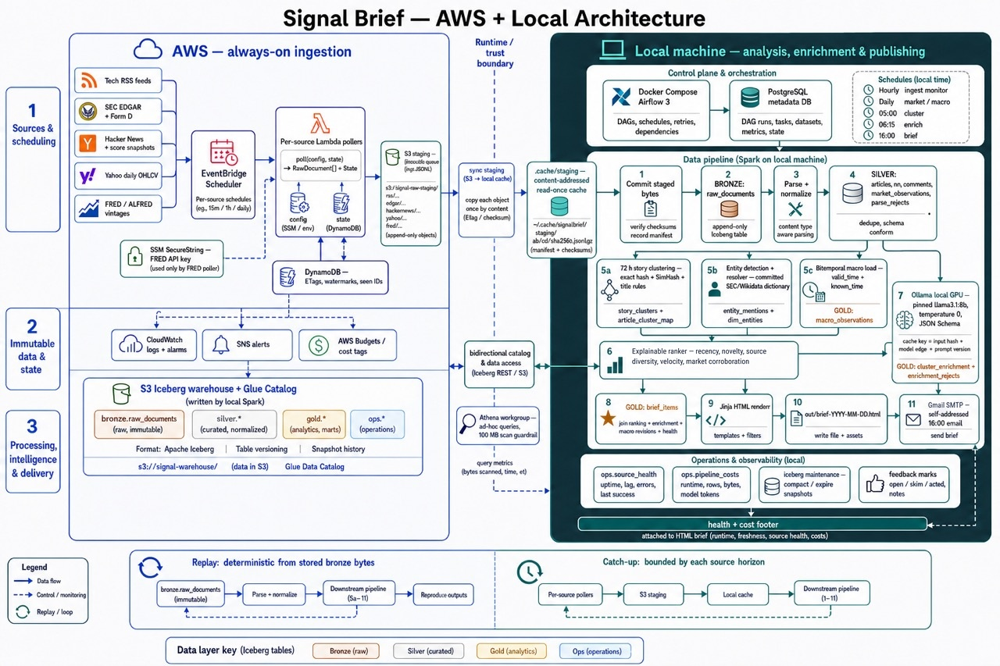
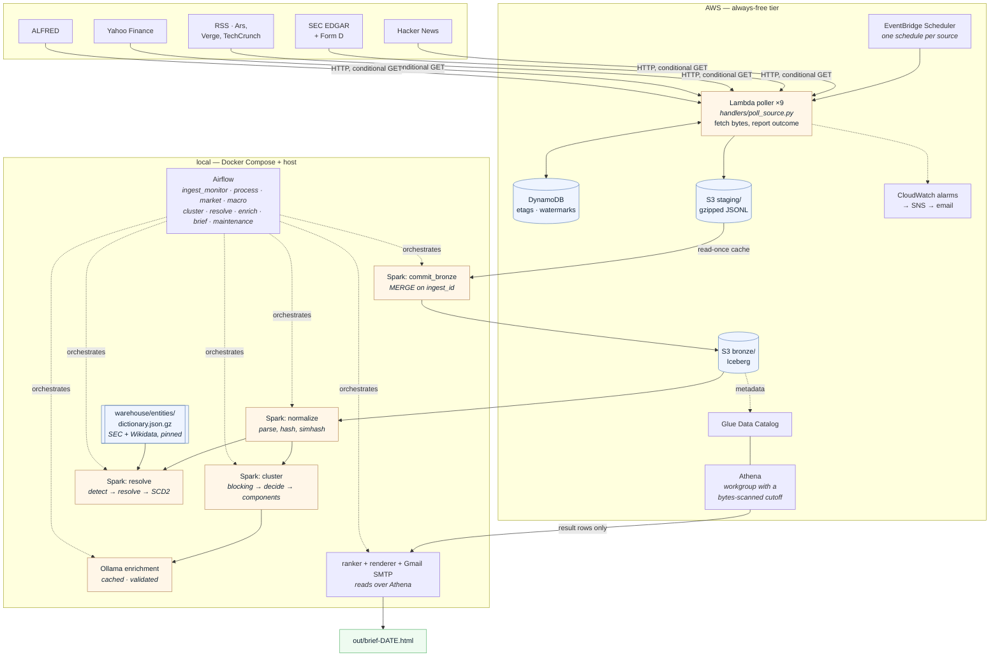
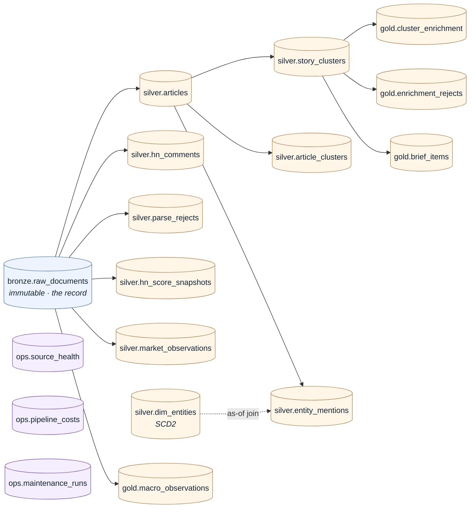
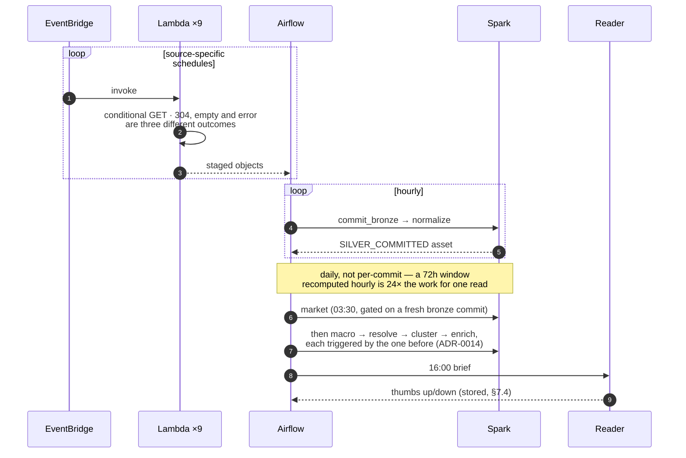

# Architecture

What runs where, and why the line falls where it does. [`SPEC.md`](../SPEC.md) §4 is the
source of truth; this is the picture, kept current with what is actually built.

**Read the shape first: two boundaries, one deliberate.** Ingestion is serverless and in AWS
because it must run whether or not a laptop is on. Processing is local because EMR, MSK and
MWAA buy nothing here that `s3a` and Docker Compose do not — [ADR-0002](decisions/ADR-0002-local-runtime-shape.md)
records that decision and what would reverse it.

The raster diagrams in `docs/assets/` carry the deployed shape: the 16:00 send, delivery over
Gmail SMTP ([ADR-0013](decisions/ADR-0013-brief-delivery-over-gmail-smtp.md) — the SES identity
and role are deleted, not dormant), and the ranker's `novelty` component. They have **no vector
source** — checked against this repo, its history, and the bundle on `audit/docs-code-reality`,
all of which hold only JPEGs — so a label that goes stale is repaired in place inside its own
bounding box rather than redrawn, and the diff is asserted to touch nothing else. The editable
diagrams below show the current table lineage and daily sequence; see
[`docs/operations.md`](operations.md) for the schedules and failure semantics they do not show.

## The system

**The one arrow worth staring at** is `Athena → brief`. The brief is a *query*, not a
transform, so it does not open a Spark session against `s3://`. Athena scans inside AWS and
returns tens of result rows, which keeps SPEC §10.1's egress off the dev box and is what
finally populates the footer's `bytes_scanned` and `estimated_cost_usd`. A morning brief is
three queries and about **$0.00014**.

## Why bytes cross the Lambda boundary undecoded

The poller does one HTTP GET and writes **gzipped JSONL** to `staging/`, base64'ing the
payload rather than decoding it. A separate local Spark job MERGEs staged objects into
`bronze.raw_documents` on `ingest_id`.

That split is a packaging constraint, not taste: writing Parquet in the Lambda means shipping
pyarrow + numpy (~185 MB) into a function whose whole job is one GET, uncomfortably close to
Lambda's 250 MB ceiling. `tests/test_lambda_artifact.py` fails the build if the handler's
import chain ever pulls in pyarrow, pyspark, pandas or jinja2.

Feeds also routinely lie about their encoding, and decoding is interpretation. Interpretation
belongs later, against stored bytes, where a mistake is fixable by re-running rather than by
re-fetching something that is no longer served.

## Tables

**Three different relationships with time, and mixing them up is how a lake rots:**

| | write mode | why |
|---|---|---|
| `bronze.raw_documents` | MERGE on `ingest_id`, insert-only | An immutable record of what a source served. Re-running an interval inserts nothing, which is what makes replay safe. |
| `silver.articles`, `hn_comments`, `hn_score_snapshots`, `market_observations`, `parse_rejects` | MERGE on the natural key | Facts about documents, score observations, market bars, and parse failures. |
| `story_clusters`, `article_clusters`, `entity_mentions` | **replace the partition** | Not facts — outputs of a function of (window, dictionary, algorithm). Re-running after a threshold change must *replace*, or the table accumulates contradictory answers and every count over it stops meaning anything. |
| `dim_entities` | **SCD2 — supersede, never overwrite** | An article published the day before Facebook became Meta did not retroactively become an article about Meta. `valid_from` / `valid_to` / `is_current`. |
| `gold.cluster_enrichment`, `gold.enrichment_rejects`, `gold.macro_observations`, `gold.brief_items` | cache/append, MERGE, or date-scoped replacement as appropriate | Governed enrichment, bitemporal macro observations, and the decisions shown to the reader. |
| `ops.source_health`, `ops.pipeline_costs`, `ops.maintenance_runs` | keyed monitoring records | The queryable operational history used by the footer, alerts, and cost reporting. |

Partitioning: bronze by `(source_id, ingest_date)`; `articles` by `days(event_date)` where
`event_date = coalesce(published_at, fetched_at)` — a deliberate deviation recorded in
[ADR-0007](decisions/ADR-0007-event-date-partitioning.md), because `published_at` is nullable
by design and a null partition key cannot be pruned.

## The daily cycle

Clustering and resolution run **once a day rather than off the hourly asset**, because a
72-hour window recomputed on every commit is 24× the work for one read. Since
[ADR-0014](decisions/ADR-0014-daily-chain-ordered-by-assets.md) they are triggered by the daily
stage before them rather than by a cron of their own, so Airflow enforces the order instead of
the arithmetic between five cron expressions — which is what let a sleeping laptop run the
whole chain against the previous day's bronze. The hourly `SILVER_COMMITTED` is still declared
as an inlet, so the real data dependency stays visible in the graph.

## What is not built yet

The table below is the actual outstanding-work list, not a diagram caption.

| | phase | status |
|---|---|---|
| Ollama enrichment — summary, topic, extraction, cached and validated | 4B | done — `enrich/`, `gold.cluster_enrichment` |
| ALFRED bitemporal macro store | 4B | done — `spark/jobs/macro.py`, `gold.macro_observations` |
| Email delivery at 16:00 | 4A | done — Gmail SMTP, `brief_dag` |
| Maintenance DAG — compaction, snapshot expiry, orphan cleanup | 4A | done — `maintenance_dag.py`, 02:00 daily |
| dbt migration of silver→gold; Kafka + Structured Streaming | 5 | gated on [ADR-0001](decisions/ADR-0001-no-kafka.md)'s re-entry criteria — not yet met |

## Why this is not an AWS Infrastructure Composer diagram

Composer is a good tool for the shape it targets — and the ingestion path here
(`EventBridge Scheduler → Lambda → S3 + DynamoDB`) is squarely in it. It does not fit the
rest, for three reasons worth writing down so the question does not get re-asked:

1. **Most of this is not AWS.** Composer models AWS resources only, so the entire processing
   layer — every Spark job, Airflow, the eval harness, the renderer — is invisible to it.
2. **It emits CloudFormation/SAM.** This repo's infrastructure is Terraform, with its own
   state backend and a CI role assumed via OIDC ([ADR-0005](decisions/ADR-0005-aws-guardrails.md)).
   Composer cannot import Terraform, so using it means either a rewrite or two definitions of
   one system that will drift.
3. **Only some resources get first-class treatment.** Lambda, S3, DynamoDB, SNS and
   EventBridge have cards that wire themselves; Glue databases, the Athena workgroup,
   CloudWatch alarms and IAM roles are generic resources you hand-edit, which is a YAML editor
   with boxes around it.
