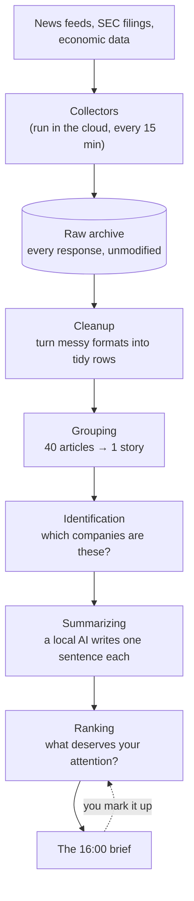

# How Signal works, in plain English

*For readers who don't work in data engineering. No prior knowledge assumed — every piece
of jargon is explained the first time it appears, and there's a decoder at the bottom.*

This document explains **what each build phase is for**. The [`SPEC.md`](../SPEC.md) is the
engineering specification and assumes you already speak the language; this one doesn't.

---

## The one-paragraph version

Every morning at 16:00, Signal emails you a short brief about what actually happened in
tech, finance, and the economy. To produce it, the system reads news feeds, regulatory
filings, and economic data all day; works out which of the thousands of articles are
really *the same story*; identifies which companies are being talked about; ranks the
stories by how genuinely new and important they are; and throws away almost everything.

The hard part is not fetching the news. It's everything after.

---

## The problem it exists to solve

One company acquires another. Within an hour there are forty articles about it — the same
event, rewritten forty times, plus eight wire-service reprints that are word-for-word
identical.

A naive news app shows you forty items. Signal shows you one, and tells you that forty
outlets covered it, which is itself a signal about how big the story is.

Doing that reliably requires answering questions that sound simple and aren't:

- Are these two articles about the same event, when they share no headline words?
- When an article says "Meta", does it mean the company, or metadata, or a metaphor?
- The government revised last month's job numbers down. What did we *think* was true at
  the time, versus what do we know now?

Each phase below builds one layer of that answer.

---

## A map of the system

Two halves, on purpose:

**The collectors run in the cloud** (Amazon Web Services), because news doesn't wait for
your laptop to be switched on. They're small, cheap programs that wake up on a timer, ask
a website "anything new?", and file away whatever comes back.

**Everything else runs on the developer's own machine**, because renting cloud computers
to do the thinking would cost real money and buy nothing.

---

## The phases

Each phase has to work, and be documented, before the next one starts. That rule is the
reason the project can be picked up after a two-week gap without unravelling.

---

### Phase 0 — Prove the shape *(done)*

**In one sentence:** build a miniature version of the whole system, end to end, using
invented data.

**Why bother with fake data?** Because the most expensive mistake in a project like this
is discovering in month three that two pieces don't fit together. So before touching a
real news feed, Phase 0 built a complete but tiny pipeline: a pretend news source that
returns the same eleven made-up articles every time, running all the way through to a
rendered HTML brief.

The fake articles are deliberately nasty. Some are the same story from four different
outlets. Two are byte-for-byte identical reprints. One has no publication date. One claims
to be published *in the future*, which is always a lie. If the miniature system handles
those, the shape is right.

This is sometimes called a **walking skeleton** — the whole skeleton, walking, before any
muscle is attached.

**How we knew it worked:** a fresh copy of the project, on a machine that had never seen
it, produced a brief.

---

### Phase 1 — Collect the real thing *(collectors live; the day-long switch-off test deferred)*

**In one sentence:** replace the invented news with three real sources, and never lose a
byte of what they send.

The three sources were picked because they're *different from each other* in ways that
matter:

| Source | What it gives | The awkward part |
|---|---|---|
| A tech news feed | Ordinary tech coverage | Only shows the last few hours. Miss it and it's gone forever. |
| Hacker News | What engineers are paying attention to | Every item has a permanent number, so nothing is ever truly lost. |
| SEC filings | Company disclosures, as officially filed | The regulator blocks you if you're impolite about it. |

**The central rule: raw responses are never modified, and never re-fetched.** Whatever a
website sends back gets filed away exactly as it arrived, and is never edited afterwards.
Every later step re-derives its results from that archive.

This sounds fussy. It's the single most important decision in the project. It means any
bug found in six months can be fixed by re-running the analysis over responses already
collected — rather than discovering the original data is gone and the mistake is permanent.

**Two ideas that get confused, and shouldn't be:**

- **Replay** — redo the analysis using responses already in the archive. Always possible,
  always produces the same answer. This is the promise the project actually makes.
- **Catch-up** — the system was offline for a day; go and re-fetch what was missed. This
  is *bounded by what each source will still give you*. Hacker News can be recovered
  completely. The SEC goes back about a day. The tech news feed only holds a few hours —
  so a day of downtime means a day permanently lost.

The honest engineering here is that when catch-up can't recover something, the system
**writes down what it lost and why**, and prints it at the bottom of the brief. A thin
news day and a broken pipeline look identical unless someone makes the difference visible.

**How we'll know it worked:** switch the collectors off for a full day, switch them back
on, and show that replay reproduces the stored day exactly — no duplicates, nothing
missing — while catch-up recovers what it honestly can and reports the rest as a gap.

**Where it actually stands:** the collectors are live and running on a timer. The archive
holds real data. Replay and catch-up are proven in tests and the replay half is proven in
production. The full day-long switch-off test is still to do.

---

### Phase 2 — Make it answerable *(done)*

**In one sentence:** turn the raw archive into something you can ask questions of.

The archive from Phase 1 is faithful but unfriendly — it's the web pages exactly as
received, in whatever format each site happens to use. Phase 2 turns that into clean,
uniform rows: one row per article, with a title, a body, a publisher, a date, all in the
same shape regardless of where it came from. Along the way it also added three more
sources (SEC Form D, The Verge, Ars Technica) on top of Phase 1's three, so the archive
this phase reads from now holds six.

Data work often describes this as three tiers, by analogy with metal:

- **Bronze** — raw, as received, never edited *(Phase 1)*
- **Silver** — cleaned and made uniform *(Phase 2)*
- **Gold** — the finished, useful output *(Phase 4)*

The point of keeping all three is that if the cleaning logic turns out to be wrong, bronze
is still there to redo it from.

**How we'll know it worked:** someone unfamiliar with the project can set it up and answer
a question nobody planned for — and we can state exactly what that question cost to run,
in cents.

**How it actually turned out to work:** a small "translator" per source turns each one's
particular format (RSS, Atom, HN's JSON) into the same plain shape, a Spark job turns
that into real rows on a real queryable table, and a scheduled step keeps doing that
automatically as new data arrives — no one has to remember to run it. Hacker News
comments turned out to need their own separate table rather than being squeezed into
"articles," because they're a fundamentally different kind of thing (a comment doesn't
have a publisher or a byline) and forcing them into the article shape would have made
every article count misleading.

Asking a question against the result is a real command now, not a hypothetical:
`make athena-query Q="..."` prints the rows, how many bytes it had to scan to find them,
and what that costs — a fraction of a cent, today, because the archive is still small.
`docs/athena.md` walks through several real questions asked this way, including the
one this phase's design turned on: does filtering by a *stored, computed* date column
scan less than filtering by the date a source merely *claims* — and by how much.

---

### Phase 3 — Work out what's the same, and who's who *(not started)*

**In one sentence:** collapse forty articles into one story, figure out which real
companies are being discussed — and start actually reading a brief every morning while
that gets built.

**First, before any of the hard parts: a deliberately bad brief.** The very first task of
this phase is to point the existing page-builder at the real archive and start producing a
daily page from real articles. It won't be good. Stories won't be grouped, there's no AI
summary, nothing gets emailed — it's just the real articles from the last day, sorted by
recency and how many outlets carried them, in a file you open in a browser.

The reason to do it first is that the project's actual goal is *reading it every morning
for a month*, and that's the one thing no amount of extra effort can speed up — a month
takes a month. Waiting until everything is polished before the first real brief means the
clock starts as late as possible, and it means discovering "these aren't the stories I
actually care about" only after all the sophisticated machinery is built around them.
Better to find that out now, while the sources and the scoring are still cheap to change.

It's also nearly free to do: the page-builder, the scoring code, and the HTML template
have all existed and been running since Phase 0 — against fake data. Pointing them at real
data is wiring, not new construction. Everything after this improves a page that already
exists rather than building toward one that doesn't.

Then the two hard problems.

**Grouping the same story.** Handled in four passes, cheapest first, because the cheap
methods catch most cases and the expensive method is only worth running on the remainder:

1. Identical text — catch the literal reprints.
2. Nearly identical text — catch light rewrites and syndication.
3. Genuinely the same event, described differently. *"Apple acquires X"* and *"X to be
   bought by Apple"* share almost no words. This needs a technique that compares
   **meaning** rather than wording.
4. Pick which version of the story to show, and count how many independent outlets carried
   it — because that count is useful information, not something to discard.

**Identifying companies.** Turning the word "Meta" into *the company Meta Platforms, ticker
META* is harder than it looks. "Apple" might be a fruit supplier. A subsidiary should
probably roll up to its parent. Companies rename themselves, which means the answer to
"what is this company called?" depends on *when you ask*.

When the system isn't confident, it **leaves the mention unlinked rather than guessing**.
A wrong link is worse than no link.

**How we'll know it worked:** both are graded against several hundred examples labelled by
hand, and the scores are published. Most projects of this kind claim these features work.
Very few say how well. And by the end of this phase you've been reading a real brief every
morning for weeks — a rough one, but a real one.

**A note on the labelling.** Those "several hundred hand-labelled examples" are about 500
judgement calls made one at a time by a person, and they're the least interesting work in
the whole project — which is exactly why they get put off until they become a wall. So
they're deliberately spread out: roughly twenty a day while the code is being written,
against the real archive that already exists. They're also done *before* the matching code,
not after, so the answers aren't quietly bent to agree with whatever was just built.

---

### Phase 4A — Rank it and send it *(built 2026-08-22; three mornings still to read)*

**In one sentence:** the scoring system decides what's worth your morning, and the brief
starts arriving in your inbox instead of sitting in a file.

**The ranking decides what you don't see.** A brief is useful because of what it leaves
out. Stories score on: how genuinely new the narrative is, how many independent outlets
carried it, how fast attention is accelerating, whether it touches things you care about,
whether the market visibly reacted, and your own thumbs-up/down from previous mornings.

The scoring weights are **set by hand and stay set by hand** — one person's daily marks
are far too little data to learn from, and pretending otherwise would produce a system
that overfits to last week's mood. But because the brief has been arriving since Phase 3,
those weights get set against months of real reading rather than guessed at cold.

This phase also clears the small pile of things earlier phases knowingly left open: proving
the day-long switch-off recovery against the real deployed system rather than only in
tests, fixing a blind spot where a frozen feed still looks healthy, and adding a second
Hacker News collector — the current one sees each story exactly once, at birth, when its
score is 1, so "how fast is this gaining attention" is currently unanswerable. Each of
those gates a claim the project wants to make honestly, so each one is listed rather than
remembered.

**How we'll know it worked:** you read it three mornings in a row and mark it up.

---

### Phase 4B — Let an AI help, and remember what was revised *(built 2026-08-22; acceptance pending)*

**In one sentence:** a local AI writes the summaries, and the economic figures start
keeping track of their own corrections.

These two are grouped together because they're the two things that most make this not a
news reader, and putting them in their own phase is what stops them being squeezed out by
more urgent-feeling plumbing.

**The AI part is deliberately small and tightly governed.** A language model runs on the
developer's own computer — nothing is sent to an external AI service — and does three
narrow jobs per story: one sentence of summary, a topic label, and pulling out specific
facts (amounts, funding round type, headcount changes).

Every one of those jobs is treated with the same suspicion as any other part of the
system:

- Answers are **cached**, so the same input is never paid for twice.
- Every answer is **checked against a strict format**, and anything malformed is set aside
  for inspection rather than quietly used.
- Accuracy is **measured against 100 hand-labelled examples**, so swapping to a different
  model is a measurement rather than a hunch.
- The exact model version and prompt wording are **recorded**, because the same question
  asked of a different model gives a different answer, and pretending otherwise makes
  results irreproducible.

**The revisions problem.** Economic figures get revised for months after publication.
Most systems overwrite the old number and silently destroy the record. Signal keeps two
separate dates for every figure: *the period it describes*, and *the date it was
published*. That makes "what did we believe on March 14th?" a question you can answer
rather than an archaeology project — and lets the brief say things like *"payrolls revised
down 46,000 across the prior two months"*, which is often more important than the headline
figure and is routinely buried.

This part can be built late without losing anything, because the data source serves every
past version of every figure on demand — nothing is lost by starting later. That's a
statement about the *data*, though, not about the schedule: it originally shared a phase
with the whole delivery pipeline, which is precisely what put it at risk of being dropped
when that phase ran long. Hence its own phase.

**How we'll know it worked:** a 30-day re-run reproduces the archive, the cleaning, and the
grouping identically — with the AI answers coming back from the cache rather than being
re-asked, at a published hit rate.

---

### Phase 5 — Polish *(not started)*

**In one sentence:** improve the machinery, but only where there's evidence it's needed.

Several well-known tools were deliberately *left out* of this project, each with a written
note explaining what would have to become true to justify adding them. Phase 5 is where
those notes get revisited against real operating experience.

The test is 14 consecutive daily briefs, and a written before-and-after justification for
anything added.

**One thing that used to live here has a deadline instead of a phase.** The plan includes
deliberately spending a week trying one expensive cloud service, measuring what it costs,
and then deleting it — so the project can say "I evaluated this, here's the bill, here's
why I chose the cheaper thing" rather than name-dropping it. That week runs on free signup
credits which **expire on a fixed date** (roughly February 2027). Left in the last phase, a
delay anywhere earlier wouldn't postpone it — it would cancel it permanently. So it's now a
deadline to hit whenever there's a spare week, not a step to reach.

---

## The jargon decoder

| Term | What it actually means |
|---|---|
| **Pipeline** | The whole assembly line: data comes in one end, the brief comes out the other. |
| **Ingest** | Fetching data from outside and filing it away. |
| **Bronze / silver / gold** | Raw, cleaned, finished. Three copies at different stages of processing. |
| **Poller** | A small program that wakes on a timer and asks a website "anything new?". |
| **Watermark** | A bookmark. "I've read up to here" — so the next run doesn't start over. |
| **Backfill** | Going back to collect data from a period you missed. |
| **Idempotent** | Running it twice does the same thing as running it once. Vital, because retrying after a failure must not duplicate everything. |
| **Deduplication** | Recognising that several things are actually the same thing. |
| **Entity resolution** | Working out that "Meta", "Meta Platforms" and "Facebook's parent" are one company. |
| **Orchestration** | The scheduler deciding what runs when, and what to do when something fails. |
| **Serverless** | Code that runs on demand without a computer sitting idle waiting for it. You pay per run, and at this volume that's free. |
| **Table format (Iceberg)** | A way of storing large tables of data in cloud storage so they can be queried, updated, and rolled back like a database. |
| **Data catalog** | The index that records which tables exist and what's in them. |
| **Infrastructure as code (Terraform)** | Describing the cloud setup in text files, so it's reviewable, repeatable, and deletable — rather than clicked together by hand and forgotten. |
| **Replay vs catch-up** | Redo the analysis from stored data, versus go and re-fetch what was missed. Very different guarantees — see Phase 1. |

---

## Two things worth understanding, if nothing else

**1. The archive is sacred.** Everything else in the system can be deleted and rebuilt
from it. This is why so much care goes into a step that looks boring — the fetching. A
cleaning bug is an afternoon's fix if the raw responses were kept, and unfixable if they
weren't.

**2. The system says when it doesn't know.** A mention it can't confidently identify is
left unlinked. Data it couldn't recover is reported as a gap. A malformed AI answer is set
aside rather than used. The brief carries a status line showing how the pipeline is
running when it produced that edition.

Most of the engineering effort in this project goes into that second point. A system that
quietly does the wrong thing is far more dangerous than one that stops and says so.

---

## Where things stand today

| Phase | Status |
|---|---|
| 0 — Prove the shape | Done |
| 1 — Collect the real thing | Done — including the day-long switch-off test, run for real on 2026-08-21 |
| 2 — Make it answerable | Done |
| 3 — Same story, and who's who *(opens with the first real brief)* | Done |
| 4A — Rank it and send it | Built — the acceptance is three mornings read, which is calendar time |
| 4B — AI summaries, and revision history | Built — waiting on a local model, a free API key, and 30 days of history |
| 5 — Polish | Not started |

A real brief is being produced from real data and read every morning — that started at the
very beginning of Phase 3, deliberately rough, and the roughness is the point: it has found
a defect on every reading so far. What exists today is a system that reliably collects and
archives, tells you honestly when it couldn't, turns that archive into rows you can ask real
questions of with a real price tag attached, and groups the day's coverage into stories with
the companies in them identified.

What 4A is adding now: a ranker that uses more than "how recent and how many outlets", and
delivery to your inbox at 16:00 rather than a command you have to remember to run. The AI
summaries everyone assumes come first come last, in 4B — because a summary of the wrong ten
stories is worse than no summary at all.

*Phase 4 was one phase until 2026-08-20; it held ten separate deliverables, including both
of the things this project most wants to be judged on. It was split so those two can't be
crowded out by more urgent-feeling plumbing. The reasoning is written down in
`docs/decisions/ADR-0008`.*

---

*Related reading: [`SPEC.md`](../SPEC.md) for the engineering specification,
[`docs/decisions/`](decisions/) for why particular choices were made and what was rejected,
and [`docs/runbooks/`](runbooks/) for the step-by-step state of each phase.*
