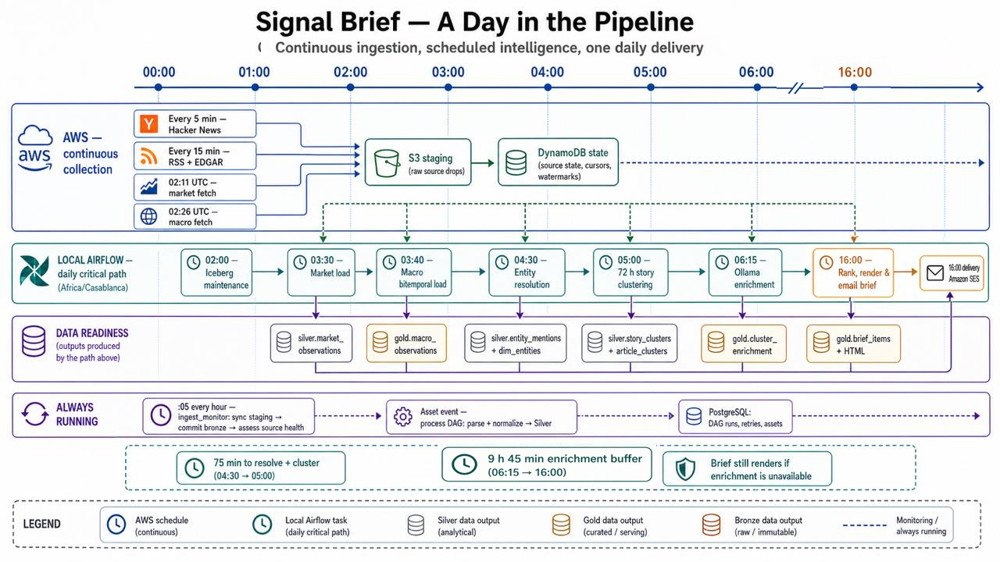
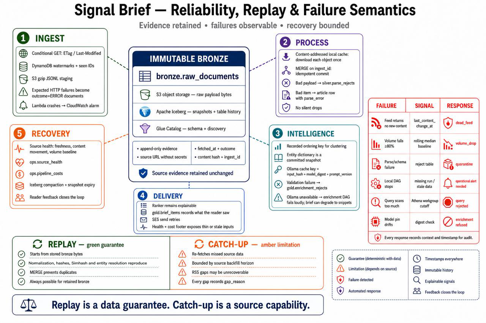

# Operations

How Signal actually runs, day to day, and what happens when a piece of it doesn't.
[`SPEC.md`](../SPEC.md) §6 and §11 are the source of truth for schedules and monitoring;
this is the picture, kept current with what is actually built. Companion to
[`docs/architecture.md`](architecture.md), which draws what runs where rather than when.

## A day in the pipeline

Two clocks, not one. **Ingestion never stops** — Hacker News polls every 5 minutes, RSS and
EDGAR every 15, market and macro Lambdas fetch once a day at 02:11 and 02:26 UTC — because a
poller has nothing to wait for; it stages bytes to S3 and returns. **Everything past staging
is a local Airflow critical path with one deadline**: the 16:00 Africa/Casablanca send, which
is a clock time, not "whenever the last upstream table finishes" (`docs/runbooks/phase-4a.md`
records why `brief` is cron-scheduled rather than asset-triggered off `CLUSTERS_COMMITTED`).

The local chain that has to clear before 16:00, in order: `maintenance` (02:00, off-peak
compaction) → `market` (03:30, reading what the morning's Lambda polls already staged) →
`macro` → `resolve` → `cluster` (a 72-hour window) → `enrich` (the ranked head only — see
[ADR-0011](decisions/ADR-0011-enrichment-scope-and-the-first-secret.md) for why not every
cluster) → `brief` (16:00: rank, render, mail).

**Only the first and last of those are clock times.** Since
[ADR-0014](decisions/ADR-0014-daily-chain-ordered-by-assets.md) each middle stage is triggered
by the asset the stage before it emits, so Airflow enforces the order instead of five cron
expressions that only look ordered when read side by side — which is precisely what let a
sleeping laptop run the entire chain against the previous day's bronze on 2026-08-29, green
the whole way. Each stage still runs exactly once a day, so every "24x the work" objection in
those DAGs, and SPEC §7.3's "once per pre-brief window", is unaffected. `market` heads the
chain and blocks until bronze has a commit under two hours old, because a cron only means what
it says if the machine is awake to see it.

The send does not wait on enrichment: if
`enrich` is late or Ollama is down, **the brief still renders, without summaries**, rather than
being late or silent. Degradation, not failure, is the design.

## Reliability, replay & failure semantics

**Replay is a data guarantee; catch-up is a source capability**, and the project is careful
never to use the two words interchangeably (`CLAUDE.md` says so explicitly). Replay
reprocesses an interval already committed to `bronze.raw_documents` — deterministic, no
network, always available, because the bytes never move. Catch-up re-fetches what a source
missed during downtime, and is bounded by that source's own backfill horizon: complete for
Hacker News (every item has a permanent id), about a day for EDGAR, only the current window
for an RSS feed. What catch-up cannot recover is written down as a `gap_reason` per source
per interval — in `ops.source_health` and in the brief's own footer — rather than left to
look like a quiet day. Both halves were proven against the deployed pipeline with a
deliberate 24.2-hour ingestion outage; see [the README](../README.md#replay-and-catch-up-are-different)
for the measured numbers.

**Every failure class maps to a specific detection signal and a specific automated
response** — a frozen-but-200 feed is caught by content staleness rather than fetch
staleness (SPEC §11's `dead_feed`, closed in Phase 1.E after the more obvious `stale` check
proved blind to it), a volume collapse trips `volume_drop` against a rolling baseline, a
malformed row is quarantined to `*_rejects` rather than dropped, and a scan over budget is
refused by the Athena workgroup's own cutoff before it can run up a bill. None of these are
generic exceptions — each one is a named status with a written response, because a monitor
whose only two states are "fine" and "broken" trains the reader to stop checking it.

**What's actually still true of that picture, and what's since moved on:** the local half of
this chain went unmonitored for real once, on 2026-08-23 — `ingest_monitor` failed silently
for ten hours because `make clean` broke a bind mount, and nothing paged anyone, because SPEC
§11's monitoring watches the AWS half (Lambdas, CloudWatch) and had nothing to say about a
local Docker Compose stack simply not running. `docs/runbooks/phase-4b.md` has the full
account, including the guard that now exists specifically to stop that failure mode.
